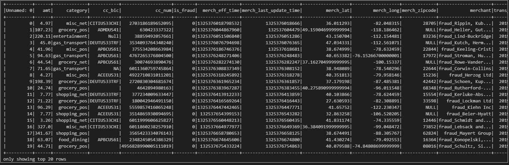
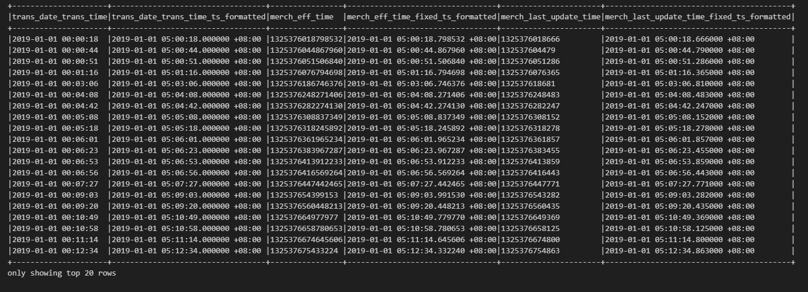
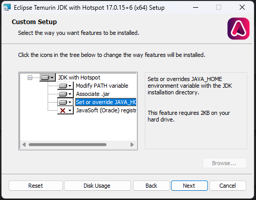

# PayNet-Assessment

Summary of my answers will be written here. Please go to assessment.ipynb to view the codes and results

### JSON Flattening & First / Last Name Extraction



### Handling Time-based Columns Conversion to desired format (YYY-MM-DD HH:MM.SSSSSS Z)


#### DateTime Gaps Analysis

##### Logical Transaction Processing Flow
1. **merch_eff_time**: When the merchant/service became effective.
2. **trans_date_trans_time**: When the actual transaction occurred (original format lacks epoch, so no milliseconds recorded).
3. **merch_last_update_time**: When merchant details were last updated.

##### Observed Gaps
###### Gap #1: Year Gap Too Far Apart
- **Issue**: Significant year and time difference (plus 7 years, minus 8 hours).
- **Details**:
  - `trans_date_trans_time_ts_formatted`: 2019-01-01 00:00:18.000000 +08:00
  - `merch_eff_time_ts_formatted`: 2012-01-01 08:00:18.798532 +08:00 (original value: 1325376018798532)
  - `merch_last_update_time_ts_formatted`: 2012-01-01 08:00:18.666000 +08:00 (original value: 1325376018666)
- **Assumption**: Merchant's machine/terminal may not be calibrated to the correct year/time.

###### Gap #2: Last Update Time Incorrect (1974)
- **Issue**: `merch_last_update_time` shows 1974 with a timezone of +07:30.
- **Details**:
  - `trans_date_trans_time_ts_formatted`: 2019-01-01 00:00:44.000000 +08:00
  - `merch_eff_time_ts_formatted`: 2012-01-01 08:00:44.867960 +08:00 (original value: 1325376044867960)
  - `merch_last_update_time_ts_formatted`: 1974-03-15 07:30:04.479000 +07:30 (original value: 132537604479)
- **Assumption**: Shortness of epoch value by one digit may be due to missing zeroes.

###### Gap #2.1: Epoch Value Discrepancy
- **Issue**: Epoch value for `merch_last_update_time` is shorter by one digit.
- **Details**:
  - Correct: `merch_last_update_time_ts_formatted`: 2012-01-01 08:00:18.666000 +08:00 (original value: 1325376018666)
  - Incorrect: `merch_last_update_time_ts_formatted`: 1974-03-15 07:30:04.479000 +07:30 (original value: 132537604479)
- **Assumption**: Similar to Gap #2, likely caused by missing zeroes in the epoch value.


# 1st Data Visualization: Category vs Total Amount and Transaction Count


## Raw Analysis
From the bar plot, we observe that `grocery_pos` had the highest total transaction amount, aggregating to approximately $14.46M. However, `gas_transport` recorded the highest number of transactions, totaling around 131.66k.

Depending on the payment gateway's pricing model, these insights can drive profitability by targeting the merchant's nature of business.

## AI-Powered Analysis (I'm not afraid of exposing myself using AI for my answers, we should ride(utilize) with them, not compete with them)
The bar plot highlights key trends in transaction data:
- **`grocery_pos`**: Highest total transaction amount at ~$14.46M.
- **`gas_transport`**: Highest transaction count at ~131.66k.

### Strategic Insights
These findings are critical for optimizing payment gateway pricing models:
- **Transaction Volume (Count-Based Fees)**: Merchants in the `gas_transport` category would generate higher fees due to their high transaction count.
- **Transaction Value (Amount-Based Fees)**: The `grocery_pos` category would be more lucrative for gateways charging based on transaction value.

### Recommendations
Understanding the merchant's business type enables tailored profit strategies:
- Payment gateway providers can optimize fee structures to maximize revenue from high-volume or high-value merchants.
- Negotiating customized rates with merchants in these categories can enhance profitability for both the provider and the merchant.


# 3rd Visualization & Insights: Frauds, its targeted category, preferred time to hit, & top hit states


When showing Fraud transactions, we can see that grocery_pos and shopping_net often been hit. So, let's filter in to those categories only


From here, we can see that a spike of frauds happening between 2AM - 7AM with 3AM at its peak. 

Human monitoring/alertness may be low as this time of the day is usually when people go to sleep. 

People naturally pay lesser attention at this time of day


additional insights, top 10 frauds happens mostly at states in mid-west regions


## PII Data Handling Approach


- **Credit Card Number**:
  - Mask all digits except the last 4 (e.g., `**** **** **** 1234`).
- **First/Last Name**:
  - Capture only the initials (e.g., John Doe → J.D.).
- **Age**:
  - Group into age buckets (e.g., 18-25, 26-35, etc.).
- **Transaction ID**:
  - Apply SHA-256 hashing for secure, irreversible anonymization.
  - Alternatively, prefer a custom key-based encryption method for better control and potential reversibility.
- **Other Sensitive PII Columns**:
  - Drop entirely to ensure compliance and minimize risk.


## Set Up virtual environment
{content here}

## For those that have never set up a Spark environment before, i gotchu:

### 1. Download and install Java 17:
You can get the Temurin build from:
https://adoptium.net/en-GB/temurin/releases/?version=17

Oh ya, I'm using Python 3.13.1, requiring me to install version 17

During install, check the box that says "Set JAVA_HOME environment variable".
<!--  -->


DO NOT MISS THISSSS!

### 2. Simple pip install pyspark

Then, to avoid further headache, simply restart your machine, and try to run:

```python
test_spark.py
```